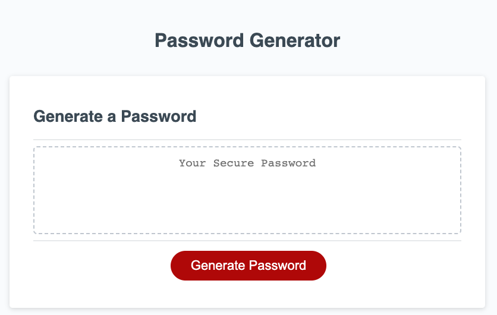
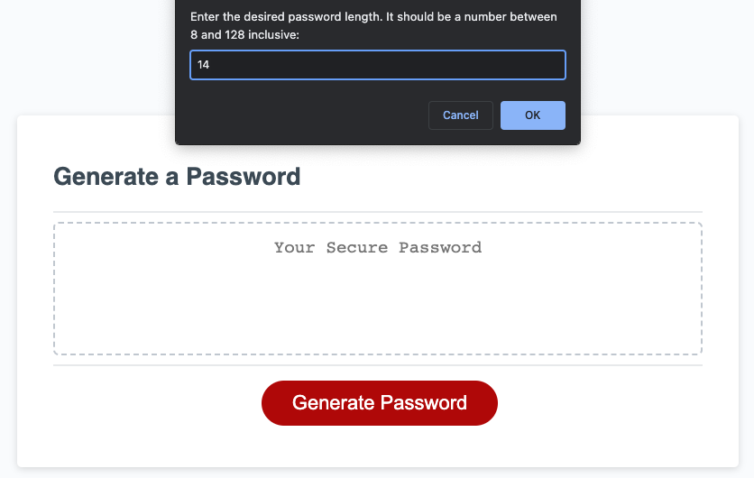
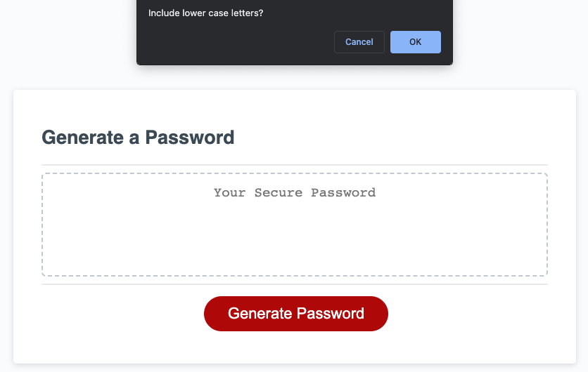
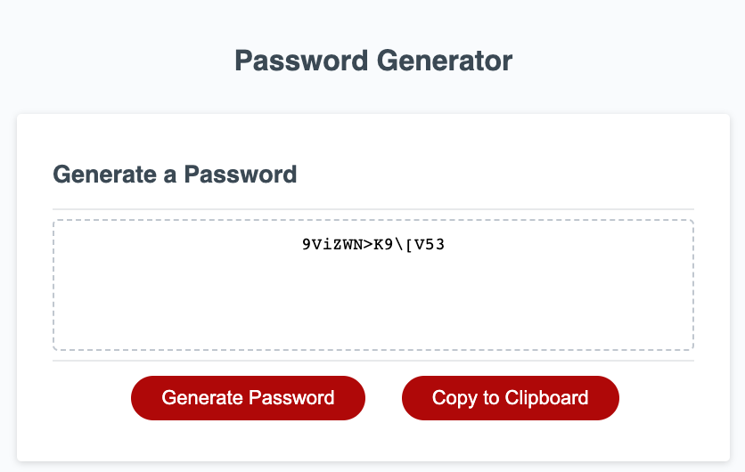

# Challenge 03 - Password Generator

## Project Description

This Password Generator will provide the end user with a way to generate strong passwords based on requirements they specify while using the app. During times when data breaches are becoming more common, generating strong passwords enables users to keep sensitive data secured.

I used basic JavaScript concepts to create the password generator including:
- Variables, arrays, and data types
- Conditional `if` statements
- Loops - `for` and `do-while`
- Functions

I added an additional piece of functionality to the app - a **Copy to Clipboard** button. Although not specified in the [Acceptance Criteria](#acceptance-criteria), I felt this important piece of functionality was missing. This also gave me the opportunity to learn more about other JavaScript features such as the `navigator` object. The button is hidden and disabled initially, but it becomes visible after the app is first used. However, the button is only enabled if a password is successfully generated.

## Table of Contents
- [User Story](#user-story)
- [Acceptance Criteria](#acceptance-criteria)
- [Links](#links)
- [Screenshots](#screenshots)

## User Story

```
AS AN employee with access to sensitive data
I WANT to randomly generate a password that meets certain criteria
SO THAT I can create a strong password that provides greater security
```

## Acceptance Criteria

```
GIVEN I need a new, secure password
WHEN I click the button to generate a password
THEN I am presented with a series of prompts for password criteria
WHEN prompted for password criteria
THEN I select which criteria to include in the password
WHEN prompted for the length of the password
THEN I choose a length of at least 8 characters and no more than 128 characters
WHEN asked for character types to include in the password
THEN I confirm whether or not to include lowercase, uppercase, numeric, and/or special characters
WHEN I answer each prompt
THEN my input should be validated and at least one character type should be selected
WHEN all prompts are answered
THEN a password is generated that matches the selected criteria
WHEN the password is generated
THEN the password is either displayed in an alert or written to the page
```
 
## Links

To access the code repository and live website, use the links below:

- ### GitHub Repository URL
    https://github.com/sergiorodriguezdev/chl-03-password-generator
- ### GitHub Pages URL
    https://sergiorodriguezdev.github.io/chl-03-password-generator

## Screenshots







